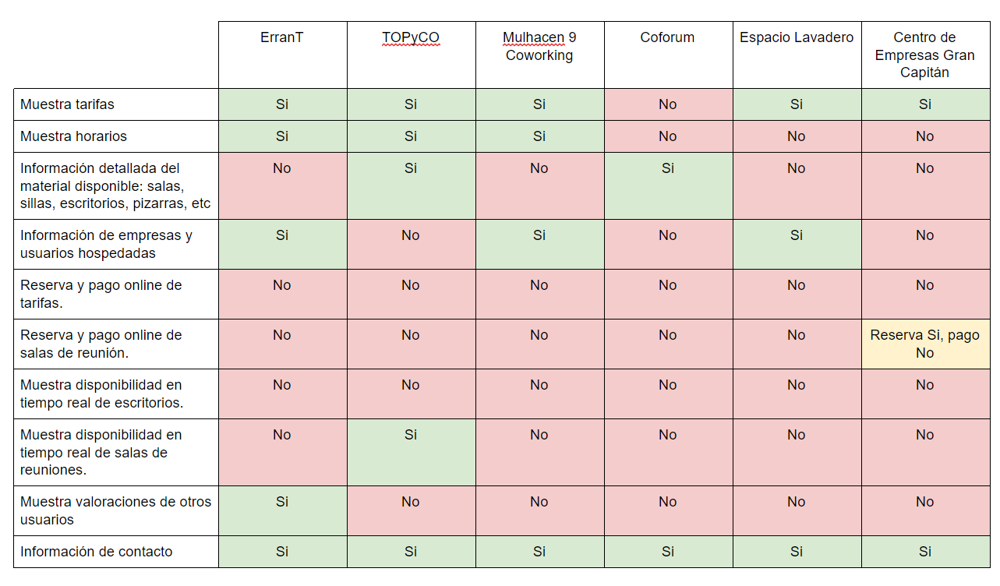
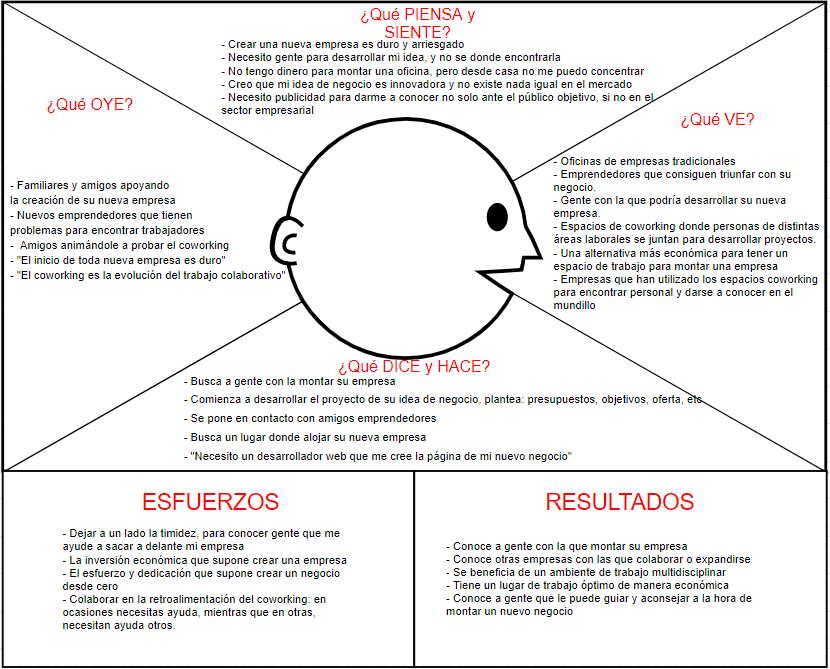
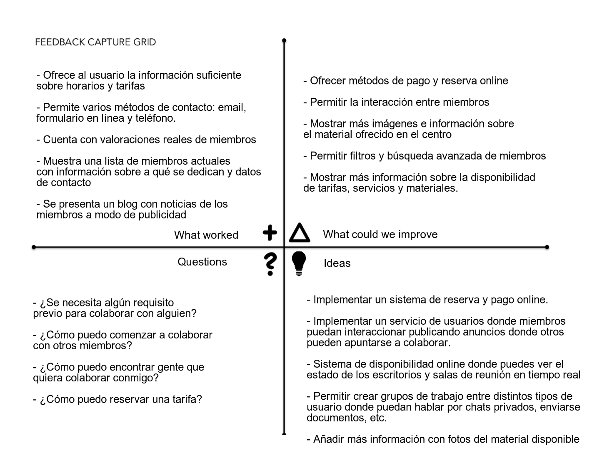
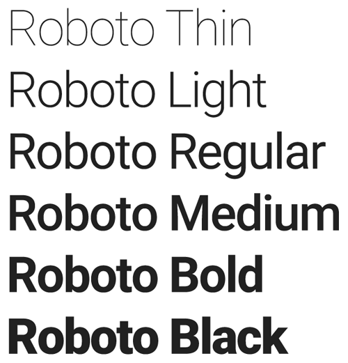
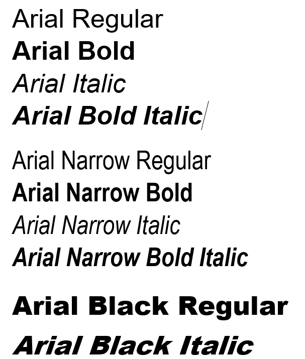
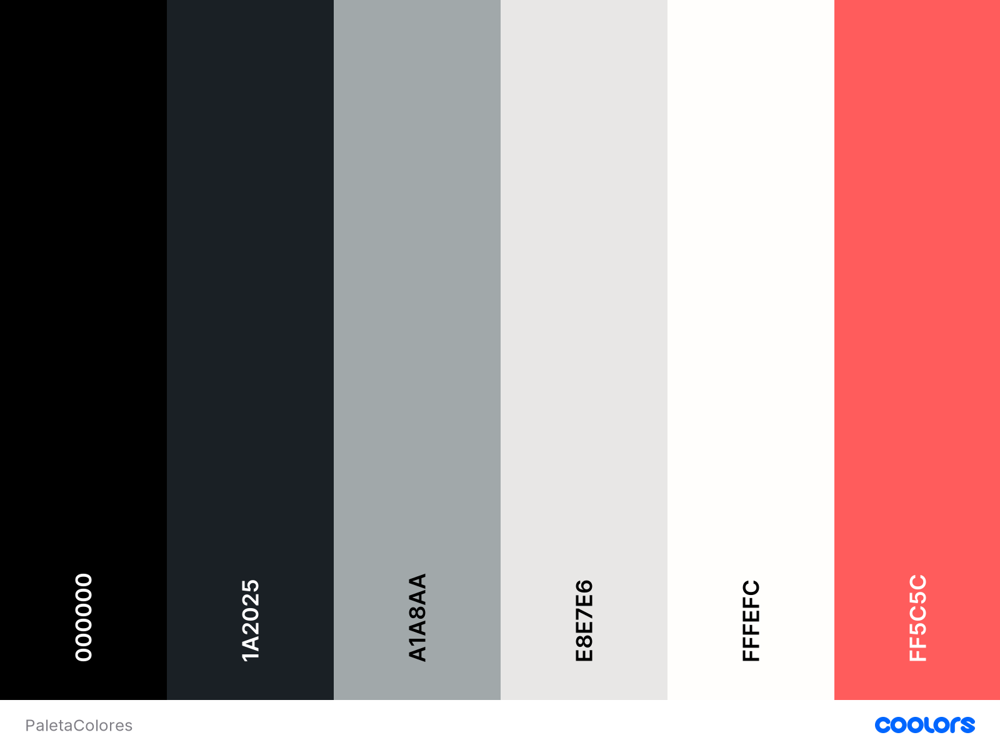

# ErranT

Descripción: Análisis y rediseño de la web ErranT, una empresa de coworking localizada en Granada.  
Autor: Carmen Martín Moreno  

---------

## Introducción

Durante este UX Case Study vamos a analizar y resideñar la página web de la empresa ErranT. Esta empresa, localizada en Granada, ofrece espacios coworking donde trabajadores y emprendores desarrollan ideas de negocio colaborativamente. Asimismo, ErranT ha creado una productora audiovisual llamada La Pecera dedicada a crear y documentar contenido audiovisual para empresas.  

Ahora bien, en este proyecto comenzaremos con un análisis exahustivo de la página actual con el que conseguiremos identificar los puntos fuertes y débiles del diseño vigente. Una vez recolectada toda la información posible, podremos plantear soluciones y nuevas funcionalidades para que la empresa ErranT aproveche al máximo posible las ventajas de tener un software que ofrezca una UX satisfactoria.  

## Análisis

En el análisis, comenzaremos haciendo un análisis competitivo que mostrará las funcionalidades fundamentales y opcionales del software. Posteriormente,  pasaremos a indentificar los grupos de usuarios. Para ello, utilizaremos un mapa de empatía y dos personas ficticias que utilizaremos para crear dos mapas de experiencia.  
Una vez planteadas todas estas técnicas, haremos una evaluación global de toda la información recogida y pasaremos al diseño.

### Análisis Competitivo

En este análisis competitivo vamos a analizar 6 páginas webs de empresas de coworking en Granada, incluida erranT. Con este proceso, pretendemos encontrar las funcionalidades fundamentales que debe presenta la página web y como de competitivo es nuestro producto en el mercado.

**Páginas analizadas:**

- [ErranT](https://www.errant.es/es/) 
- [TOPyCo](https://www.topyco.com/es)
- [Mulhacén 9 Coworking](https://www.m9coworking.com/)
- [Coforum](https://coforum.es/)
- [Centro de Empresas Gran Capitán](http://ctgrancapitan.com/)
- [Espacio Lavadero](https://espaciolavadero.com/)

**Análisis Competitivo**
 

**Conclusiones**

Tras ver el análisis anterior, hemos sacado las siguientes conclusiones:

- Todas las aplicaciones muestran información de contacto: número de teléfono, dirección, formulario de contacto, email, etc.
- Se expone información detallada de los horarios y tarifas.
- Es recomentable especificar detalladamente la información del material que ofrece la empresa y la disponibilidad por tarifa contratada.
- Ninguna de las empresas analizadas cuenta con servicio de disponibildiad, reserva y pago online de tarifas o salas de reunión.
- ErranT es la única página analizada con testimonios reales que la recomienda. Una cualidad muy recomendable para ofrecer seguridad al usuario.

### Investigación de usuarios: Grupos de usuarios

Para comenzar con la identitifación de los distintos grupos que forman el público objetivo del software, vamos a realizar alguna suposiciones sobre los distintos perfiles de usuarios que van a utilizar la aplicación:

- Emprendores que buscan empezar un negocio.
- Personas que quieren unirse y colaborar en un nuevo negocio.
- Pequeñas empresas recien creadas que buscan un espacio económico donde desarrollar su negocio.
- Autónomos que necesitan un lugar de trabajo independiente de su casa.
- Trabajadores que quieren introducirse en el mercado laboral a través de una alternativa de trabajo colaborativo.

### Investigación de usuarios: Necesidades
 
 De esta forma, las necesidades fundamentales del público supuesto son las siguientes:

- Un espacio donde trabajar.
- Un lugar donde encontrar trabajadores.
- Un espacio donde colaborar con otras empresas para agrandar un negocio.
- Un sitio donde puedes trabajar colaborando en otros negocios.
- Una oficina de negocio económica.

### Mapa de Empatía

Una vez hecho el primer paso para definir el público objetivo y sus necesidades, vamos a crear un mapa de empatía para entender profundamente los grupos de usuarios identificados:

 

De aquí extraemos la siguiente información:

- Emprender es una tarea ardua que requiere de mucha dedicación y esfuerzo al principio.
- Encontrar un equipo de trabajo con el que montar tu empresa es complicado.
- Crear un negocio supone una inversión económica importante y el coworking presenta una altenativa más económica para situar una oficina y formar un equipo.
- Para que un negocio tenga exito es muy importante darse a conocer entre el público objetivo y las empresas dedicadas al mismo sector. 

### Personas

Ya que hemos conseguido tener un entendimiento más profundo del público objetivo, a continuación utilizaremos las dos Personas ficticias diseñadas en Prácticas para crear unos Mapas de Experiencia de Usuario en los que se simule una UX realista utilizando el actual diseño de la web de ErranT.

[Armando Flores Rojas](documentos/persona1.png)  
[Vanessa Jörg](documentos/persona2.png) 

### Journey Maps

**User Journey Map: Armando**

En el primer User Journey Map, Armando tiene problemas para encontrar un equipo con el que crear su nuevo negocio. Dada esta situación, se plantea probar el coworking y encuentra ErranT. En la sección de "Coworkers", encuentra varios miembros que podrían ayudarle a comenzar su idea de negocio y decide hacerse miembro de ErranT.

[Mapa de Experiencia de Usuario de Armando](documentos/UserJourneyMap1.png)  
 
 Puntos fuertes:
 - La sección de "Coworkers" ayuda a encontrar perfiles específicos de personas con las que colaborar.

 Puntos débiles:
 - Faltan imágenes e información detallada de los materiales disponibles.
 - No se facilita la interacción entre miembros: Los medios de contacto facilitados son externos a la página.

**User Journey Map: Vanessa**

En esta ocasión, Vanessa acaba de terminar la carrera y está teniendo dificultades para entrar en el mercado laboral. La mayoría de ofertas de trabajo clásicas solicitan requisitos que no puede cumplir y busca alternativas. Al descubir qué es el coworking, encuentra ErranT y decide hacerse miembro.

[Mapa de Experiencia de Usuario de Vanessa](documentos/UserJourneyMap2.png) 

 Puntos fuertes:
 - Se muestra la información fudamental de las tarifas y horarios.
 - Se muestran varias alternativas de contacto entre los usuarios y la empresa

 Puntos débiles:
 - No existe ninguna sección específica dónde se planteen ofertas concretas dónde colaborar (Interacción entre miembros pobre).
 - No se permiten opciones de pago y reserva online. 

### Evaluación

Tras el análisis realizado, podemos decir que la UX proporcionada por ErranT es correcta. Como hemos visto con el análisis competitivo, ErranT proporciona una web bastante competitiva que presenta uno de los mejores diseños entre las los software estudiados. Sin embargo, algunas de las necesidades identificadas entre el público objetivo no son cumplidas ni por ErranT, ni por el resto de empresas investigadas.

La mayoría de problemass encontrados en ErranT derivan de no promover la interacción entre miembros. Uno de los pilares fundamentalels del coworking es la colaboración entre miembros y el software no presenta funcionalidades para facilitar la comunicación entre los mismo. Se necesita un sistema de usuarios que ayude tanto a emprendores y empresas como a trabajadores a ponerse en contacto entre sí. De esta forma, ErranT llevará el trabajo colaborativo a su mayor exponente. 

Por otra parte, otro aspecto a mejorar sería la cantidad de información presentada sobre los materiales y servicios disponibles, ya que al resultar insuficiente puede causar inseguridad en el cliente. La solución sería incluir más información acompañada de fotos.

Finalmente, la empresa ErranT se podría ver beneficiada de la automatización e informaticación de procesos como son la reserva y pago online de los productos ofrecidos.

## Diseño

Una vez realizado el análisis, hemos detectado los puntos fuertes y débiles del actual diseño de ErranT. Con esta información, seremos capaces de rediseñar la página web para que presente una mejora en la UX ofrecida. Para ello, comenzaremos resumiendo la información obtenida en el análisis y planteando soluciones con la ayuda de una matriz receptora de información.

A continuación, empezaremos el diseño planteando la arquitectura de la información mediante un sitemap acompañado de un labelling.

El siguiente paso será establecer algunas decisiones del nuevo diseño tanto estéticas como funcionales. Hasta que, finalmente, creemos una serie de bocetos a bajo nivel que ilustrarán el nuevo diseño de la pagina web de ErranT.

### Matriz Receptora de Información

Para reunir toda la información recogida en el análisis, creamos la siguiente Matriz Receptora de Información. Asimismo, en la sección de "Ideas", encontramos las nuevas funcionalidades a implementar para suplir los puntos débiles detectados y conseguir una UX mejor.

  

### Arquitectura de la información

Ya centrándonos en el diseño, planteamos la siguiente arquitectura de la información con ayuda de un Sitemap. 

Gracias al Sitemap, vemos la organización de las distintas secciones principales de la página, así como, un primera instancia del esquema de navegación. 

Para eliminar la posible ambigüedad del Sitemap, incluimos un Labelling donde se describe de forma breve y concisa el contenido de cada sección.

#### Sitemap

[Sitemap](documentos/Sitemap.png)

#### Labelling

[Labelling](documentos/LABELLING.pdf)

### Guía de diseño

En esta sección, especificaremos algunas de las decisiones para mejorar el diseño de la web de ErranT.

#### Funcionalidades

- La estructura de todas las sección de la página web será la siguiente:

		- En la parte superior: Una barra de navegación (de 400px de ancho) con las principales secciones de la aplicación: Espacio Coworking Granada, La Pecera Comunicación, Blog, Iniciar sesión/Perfil y Búsqueda. Este menú seguirá el paradigma
		- En la parte inferior: Un footer (de 60px de ancho) con acceso rápido a las redes sociales, la información de contacto y la información de accesibilidad.

- Haciendo click en el logo de la empresa se volverá a la página principal.

- Implementar un diseño breadcrumbs para que el usuario sepa su ubicación exacta en la web y se facilite la navegación.

- Los botones de "Atrás" permitirán retroceder en un solo paso. Se guardará la siguiente información: estado de los formularios activos, ubicación exacta del usuario.

- Para procesos que impliquen varios pasos como reservar una tarifa, se mostrará un seguimiento del proceso: número total de pasos y paso actual señalziado.

- Priorizar la sencillez en los formularios incluyendo checkboxes o menús desplegables para preguntas con respuestas que se puedan prefijar. Además, en este tipo de campos se incluirá una opción "Otro: " para dar flexibilidad a las respuestas.

- Para los campos de texto de los formularios, se facilitaran texto a modo de "Placeholder" para indicar al usuario cómo se debe rellenar.

- Mostrar errores de formularios en tiempo real.

- Al contratar una tarifa, se solicitará un email. Al pagar y confirmar ese servicio, se enviará un correo con un número de socio generado automáticamente. Con el email facilitado, el número de socio y una contraseña se podrá crear una cuenta de usuario para acceder a las funcionalidades de miembros. Los servicios adicionales de usuario serán:

	- Publicar ofertas de colaboración.
	- Acceder al tablón de ofertas activas y apuntarse.
	- Crear y participar en grupos de trabajo.
	- Crear y utilizar chats entre miembros.
	- Acceso al servicio de disponibilidad en tiempo real. Los usuarios podrán ver el estado de los puestos de trabajo en todas las salas.

- Para informar a los usuarios de las novedades y mensajes se establecerá un sistema de notificaciones.

- Con la intención de aumentar la accesibilidad, se han tomado las siguientes decisiones:

	- Todas las imágenes incluidas tendrán texto alternativo.
	- Los menús seguirán el patrón "Dropdown Vertical", pero se incluirá el suficiente espacio entre opciones para no perjudicar a las personas con problemas de movilidad.
	- La fuente de todos los textos serán totalmente escalables y adaptables a distintos niveles de tamaño y resolución. Al aumentar el zoom a unos niveles altos (>150%) los menús cambiarán a un patrón de "Acordeón Vertical" donde las subopciones se mostrarán y desaparecerán haciendo click sobre la opción principal de la que derivan.
	- Se incluirán opciones de navegación mediante teclado. Por ejemplo: para hacer scroll se podrá pulsar el espacio.

#### Estilo: Tipografía

Acualmente, se utiliza la misma fuente tanto para titulos como para cuerpo: Arial. Sin embargo, este rediseño busca ante todo ser acceible y tener un esquema de navegación claro y sencillo. Por tanto, vamos a intentar diferenciar perfectamente los títulos del texto. 

Para ello, seguiremos utilizando fuentes de la familia sans serif para facilitar su lectura:

- El cuerpo continuará utilizando **Arial**
- Los títulos utilizarán **Roboto**

#### Estilo: Colores

En cuanto a los colores, se mantendrán la paleta actual. No obstante, en ocasiones se presentan elementos con un contraste insuficiente para personas con discapacidad visual (fuente blanca sobre fondo gris). Por lo que, se tendrá especial cuidado para garantizar una página accesible para personas con discapacidad visual. 

A continuación, se especifican los colores utilizados para ciertos elementos de la página web:

| Elemento | Color (HEX)|
|:--------:|:----------:|
| Titulos | #1A2025 |
| Cuerpo de texto | #000000 |
| Fondo de la aplicación |  #FFFEFC |
| Fondo del footer | #1A2025 |
| Titulo de la barra de navegación | #000000 |
| Titulo del footer | #FFFEFC |
| Botones | #FF5C5C | 
| Texto en botones | #000000 |
| Menús | #FFFEFC |
| Elemento seleccionado | #FF5C5C |
| Cajas de texto | #E8E7E6 |
| Checkboxes (fondo) | #FFFEFC |
| Chechboxes (tick) | #FF5C5C |
| Notificaciones | #FF5C5C |
| Bubbles del chat | #E8E7E6 |
|Viñetas | #FF5C5C |

### Wireframes

Una vez establecidos todos los patrones de diseño, procedemos a crear los bocetos a bajo nivel según las decisiones tomadas. De esta forma, nos haremos una idea general de la organización y diseño de las principales interfaces de usuarios que tendrá la nueva página web de ErranT.

[Bocetos](Bocetos)