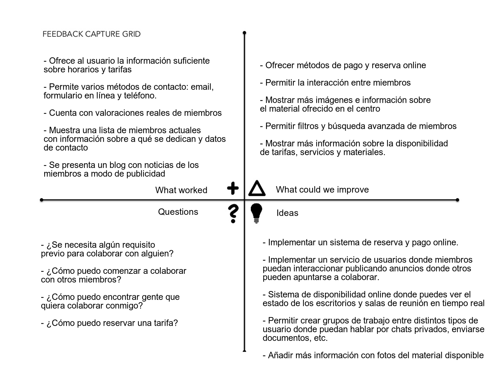

# ErranT

Descripción: Análisis y rediseño de la web ErranT, una empresa de coworking localizada en Granada.  
Autor: Carmen Martín Moreno  

---------

## Introducción

Durante este UX Case Study vamos a analizar y resideñar la página web de la empresa ErranT. Esta empresa, localizada en Granada, ofrece espacios coworking donde trabajadores y emprendores desarrollan ideas de negocio colaborativamente. Asimismo, ErranT ha creado una productora audiovisual llamada La Pecera dedicada a crear y documentar contenido audiovisual para empresas.  

Ahora bien, en este proyecto comenzaremos con un análisis exahustivo de la página actual con el que conseguiremos identificar los puntos fuertes y débiles del diseño vigente. Una vez recolectada toda la información posible, podremos plantear soluciones y nuevas funcionalidades para que la empresa ErranT aproveche al máximo posible las ventajas de tener un software que ofrezca una UX satisfactoria.  

## Análisis

En el análisis, comenzaremos haciendo un análisis competitivo que mostrará las funcionalidades fundamentales y opcionales del software. Posteriormente,  pasaremos a indentificar los grupos de usuarios. Para ello, utilizaremos un mapa de empatía y dos personas ficticias que utilizaremos para crear dos mapas de experiencia.  
Una vez planteadas todas estas técnicas, haremos una evaluación global de toda la información recogida y pasaremos al diseño.

### Análisis Competitivo

En este análisis competitivo vamos a analizar 6 páginas webs de empresas de coworking en Granada, incluida erranT. Con este proceso, pretendemos encontrar las funcionalidades fundamentales que debe presenta la página web y como de competitivo es nuestro producto en el mercado.

**Páginas analizadas:**

- [ErranT](https://www.errant.es/es/) 
- [TOPyCo](https://www.topyco.com/es)
- [Mulhacén 9 Coworking](https://www.m9coworking.com/)
- [Coforum](https://coforum.es/)
- [Centro de Empresas Gran Capitán](http://ctgrancapitan.com/)
- [Espacio Lavadero](https://espaciolavadero.com/)

**Análisis Competitivo**
 

**Conclusiones**

Tras ver el análisis anterior, podemos decir que:
- Todas las aplicaciones muestran información de contacto: número de teléfono, dirección, formulario de contacto, email, etc.
- Se expone información detallada de los horarios y tarifas.
- Es recomentable especificar detalladamente la información del material que ofrece la empresa y la disponibilidad por tarifa contratada.
- Ninguna de las empresas analizadas cuenta con servicio de disponibildiad, reserva y pago online de tarifas o salas de reunión.
- ErranT es la única página analizada con testimonios reales que la recomienda. Una cualidad muy recomendable para ofrecer seguridad al usuario.

### Investigación de usuarios: Grupos de usuarios

- Emprendores que buscan empezar un negocio.
- Personas que quieren unirse y colaborar en un nuevo negocio.
- Pequeñas empresas recien creadas que buscan un espacio donde desarrollar su negocio.
- Autónomos que necesitan un lugar de trabajo independiente de su casa.

### Investigación de usuarios: Necesidades
 
- Un espacio donde trabajar.
- Un lugar donde encontrar trabajadores.
- Un espacio donde colaborar con otras empresas para agrandar un negocio.
- Un sitio donde puedes trabajar colaborando en otros negocios.
- Una oficina de negocio económica.

### Mapa de Empatía

 

### Personas

[Armando Flores Rojas](documentos/persona1.png)  
[Vanessa Jörg](documentos/persona2.png) 

### Journey Maps

[Mapa de Experiencia de Usuario de Armando](documentos/UserJourneyMap1.png)  
[Mapa de Experiencia de Usuario de Vanessa](documentos/UserJourneyMap2.png) 

### Evaluación

## Diseño

### Matriz Receptora de Información

  

### Arquitectura de la información

#### Sitemap

[Sitemap](documentos/Sitemap.png)

#### Labelling

[Labelling](documentos/LABELLING.pdf)

### Guía de diseño

#### Funcionalidades

#### Estilo: Tipografía

#### Estilo: Colores

### Wireframes

